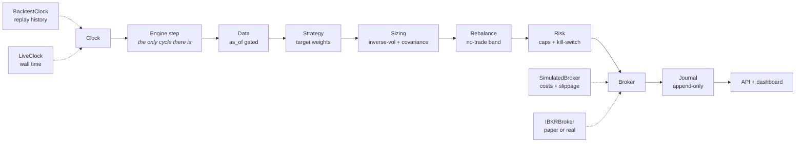

# sillage

> *dans le sillage de* — in the wake of.

A systematic multi-asset fund manager. It decides **how much of what to own**, sizes
positions by risk rather than conviction, rebalances on a schedule, and refuses to
deviate from its rules.

**The core idea: backtesting, paper trading, and live execution run the same code.**
Only the clock and the broker are swapped.



Dotted edges are the only things that change between a twenty-year replay and this
afternoon. Everything on the solid path runs identically in both, because it is the same
`Engine.step` in one file.

Status: **all seven phases built.** A point-in-time data layer, an event-driven backtest
engine, risk metrics validated against an independent implementation, the strategy, a
battery that spends seventy-one backtests trying to prove the strategy is an illusion, a
restart-safe live runner with a durable journal and a kill-switch, an Interactive Brokers
adapter, a read-only API with a dashboard, and a multi-asset sleeve. Two things are
genuinely unfinished and named as such in *Limitations* below: the broker adapter has
never met a real gateway, and nothing here has traded a real pound.
See [docs/ROADMAP.md](docs/ROADMAP.md) for the full plan and
[docs/research-log.md](docs/research-log.md) for findings along the way, including the
ones that went nowhere.

```bash
uv sync
uv run sillage data sync --universe core+crypto   # ~21y of bars, 15 instruments
uv run sillage data check                   # gaps, unadjusted splits, stale feeds
uv run sillage backtest -b spy -b 60-40 --report --attribution
uv run sillage timing-luck -s momentum-single     # how much did the rebalance date matter?
uv run sillage validate --report                  # try to prove the strategy wrong
uv run sillage live run-once                      # trade a day forward, then exit
```

## What the engine does, once per session

```
open   ──▶  execute whatever was decided at the previous close
close  ──▶  mark the book, then decide (if the schedule says so)
```

A decision made from data at a close can only be filled at the *next* open, at a price
that had not printed when the decision was made. There is no flag to disable this and
no fast path that skips it, because the moment there is one, someone will use it.

The data layer enforces the same rule from the other side: every read takes an `as_of`
and cannot return a bar that closed after it. A strategy that wants tomorrow's price
does not get a "no" — there is no code path that hands it over.

## The strategy

Once a month: rank twelve ETFs by blended 3/6/12-month momentum, take the top five, drop
any trading below its 200-day average and put that money in Treasury bills, then size the
survivors inversely to their volatility and scale the whole book — using the covariance
matrix, not a sum of individual volatilities — to a 10% volatility target. Run four
staggered copies a week apart and average them.

| 2005-01 → 2026-09 | Momentum | 60/40 | SPY | Equal weight |
|---|---|---|---|---|
| Annualised | 7.16% | 8.30% | **10.88%** | 6.47% |
| Volatility | **8.9%** | 10.9% | 18.9% | 11.6% |
| Sharpe | **0.82** | 0.78 | 0.64 | 0.60 |
| Max drawdown | **−21.8%** | −31.2% | −55.1% | −36.8% |
| Longest drawdown | **698d** | 1,092d | 1,773d | 967d |

Best risk-adjusted return, a third of the index's drawdown, recovers in two years where
the index took five — and the second-lowest return of the four. That is the trade, and
it is the whole trade.

**Where it comes from, and where it does not.** It beat the index in all three of the
sample's down years, but the margin is almost entirely 2008 (+10.6% against −36.2%).
Post-2010 a plain 60/40 beat it on every measure: 10.03% at a Sharpe of 1.00 against
7.04% and 0.80. You are buying crash insurance, and the last fifteen years are what the
premium looks like.

**It survives its own costs.** At five times the modelled commission, spread and impact
it still returns 6.64% at a Sharpe of 0.76. Most retail backtests die here.

The full argument, including the years it loses badly and why, is in
[docs/strategy.md](docs/strategy.md).

## Combining sleeves

Adding a second strategy is the only reliable way to raise a Sharpe ratio, because the
arithmetic turns on correlation rather than on how good either part is. Dual momentum and
a 60/40 correlate at 0.58, and half of each (`-s balanced`) gives:

| | Volatility | Annualised | Sharpe | Max drawdown | Turnover |
|---|---|---|---|---|---|
| Momentum | 8.9% | 7.16% | 0.82 | −21.8% | 6.89x |
| 60/40 | 10.9% | 8.30% | 0.78 | −31.2% | 0.07x |
| **Half of each** (`-s balanced`) | **8.6%** | **7.79%** | **0.91** | **−19.9%** | **3.55x** |

Better than both on Sharpe, Sortino, Calmar, drawdown and worst month — and it returns
more than momentum alone at half the turnover. The ceiling for long-only sleeves on this
universe is about 0.95; everything holding these thirteen ETFs correlates with everything
else at 0.5 or more.

## Running it forward

```
sillage live run-once
```

Processes every completed session since the last one recorded, then exits. Safe on a
cron schedule and safe to run twice — a second call finds nothing outstanding and does
nothing. It is **the same engine**: `Engine.step` is the one place the decide-execute-mark
cycle exists, and live passes a `LiveClock` where a backtest passes a `BacktestClock`.

It also runs against **Interactive Brokers** (`--broker ibkr`), which is the only way
to find out whether the cost assumptions were honest — a backtest graded by its own
estimates will always agree with itself. `sillage live divergence` pairs each intended
trade across the two journals and reports the gap in basis points against the trader,
ending with a suggested `--cost-scale` for re-running the backtest on measured
assumptions. Phase 4 established the strategy survives 5x its modelled costs, so that
number is the bar. See [docs/ibkr.md](docs/ibkr.md) — and note the adapter is written and
tested against a fake, not yet verified against a live gateway.

State lives in an append-only SQLite journal. Orders are written *before* they are sent
and keyed on an idempotency id, so a crash between the two is recoverable rather than
ambiguous. Positions are never stored — they are replayed from fills, because a stored
position and a stored fill history can disagree and there is no way to tell which is
right. Money is stored as text; SQLite's only numeric type is a float.

Before it trades it refuses on three grounds: the broker disagreeing with the journal
about what is held, prices being stale, or the fund being too far below its high-water
mark. The first live run found three quiet failures within a minute — all in
[docs/research-log.md](docs/research-log.md).

## Does it survive being attacked?

`sillage validate` runs seventy-one configurations against it — data it never saw,
parameters moved off their defaults, start dates it did not choose, the return series
resampled, and the whole thing deflated for how many configurations were tried.

- **Held out it got worse**, and that is reported rather than buried: Sharpe 0.86 in
  sample against 0.73 out, with the maximum drawdown doubling.
- **Parameters sit on plateaus.** Trend window 100→300 days reads 0.77 / 0.83 / 0.82 /
  0.81 / 0.77; the volatility lookback is flat across 20→120 sessions. Neither default
  was chosen because it peaked, because neither peaks.
- **Bootstrapped Sharpe 0.82, 95% interval 0.41 to 1.23** — wide, and clear of zero.
- **Deflated for a pessimistic thousand trials, P(the edge is not selection) = 0.9984.**

And two failures found in the process, both in the tooling rather than the strategy —
[docs/research-log.md](docs/research-log.md) has them, including the one where validating
on a single rebalance date produced the *opposite* out-of-sample verdict.

## Benchmarks

Run through the same engine, with the same costs. They are not decoration — a result
without them is meaningless. SPY made the most money and was the worst thing to hold: it
spent **four years and ten months** below its 2007 high, peaking 2007-10-09, bottoming
2009-03-09 at −55.1%, and recovering 2012-08-16. Those are the real dates, which is a
decent check that the engine is wired correctly.

`--report` writes a self-contained HTML tearsheet: equity curve, underwater chart,
rolling 12-month return, monthly heatmap, allocation over time, and per-holding
attribution.

## How much of a backtest is luck?

A strategy that rebalances monthly has to pick a day of the month, and nothing makes the
last session better than the third-to-last. Two runs differing only in that choice can
diverge by a percent a year — noise, reported as a result. `sillage timing-luck` runs
the same configuration across four dates a week apart and reports the spread:

```
rebalance date       annualised  Sharpe  max DD
month end                +7.00%    0.81  -16.0%
5 sessions earlier       +7.09%    0.75  -28.3%
10 sessions earlier      +6.19%    0.68  -25.2%
15 sessions earlier      +8.25%    0.93  -18.1%
```

**Two percentage points of annualised return, and a drawdown between −16% and −28%, from
a choice with no meaning.** The same measurement on a 60/40 gives a spread of 0.11 points
— timing luck is a property of *selection*, and a fixed-weight portfolio does not select.

Reporting the month-end run would have claimed a −16% maximum drawdown. Averaging four
staggered tranches gives −21.8%, which is the number above and the one to believe.
Turnover barely moved, because the tranches' trades partly cancel before an order is
produced.

## Is the accounting right?

`tests/golden/` runs buy-and-hold SPY over 5,453 real sessions and checks the identity
that has to hold if every step from order to fill to position to cash to NAV is
correct: **total return equals the fraction of capital invested, times the price return
of what was bought.** It holds to within one basis point.

It deliberately does not assert that the fund matches the index exactly, because it
can't. A hundred thousand dollars does not divide evenly into whole SPY shares, so a
little is left in cash and earns nothing. That drag is real — a live account has it too
— and the test measures it rather than assuming it away.

## Watching it

```bash
uv run sillage serve          # http://127.0.0.1:8000, docs at /docs
```

A read-only API and a React dashboard: equity curve, underwater chart, allocation, risk
and return, trade blotter, and refused orders. **Every route is a GET**, and the test
suite asserts that structurally — an interface that can place an order is an interface
that can be made to place one. The fund trades from `sillage live run-once` on a machine
nobody browses to.

Two panels exist because of failures Phase 5 actually hit. A banner when market data goes
stale, because a fund whose prices stopped updating keeps reporting a NAV and looks
entirely healthy. A card for refused orders, because a fund placing orders and filling
none is invisible from the equity curve, the allocation and the blotter at the same time.

```bash
docker compose up             # dashboard on localhost:8000
```

## Holding things that never close

The universe extends to bitcoin and ether, which trade 24/7 while the portfolio's
heartbeat is the NYSE. That mismatch is the whole difficulty, and it resolves in the
conservative direction: a crypto bar for a given day closes at 23:59 UTC, three hours
*after* the New York close, so at the moment a decision is made the strategy can see
crypto only through the previous day. A one-session lag, and the opposite of the mistake.

**And then the result fell apart under inspection, which is the interesting part.**
Adding crypto took the Sharpe from 0.86 to 1.03. That is the number a portfolio project
would normally lead with. It is almost entirely hindsight:

| Crypto admitted to the universe | Sharpe | Annualised |
|---|---|---|
| Never | 0.86 | 7.51% |
| **January 2018** | **1.03** | **10.05%** |
| January 2021 | 0.87 | 8.06% |
| January 2023 | 0.90 | 8.12% |

The top row is a fund that, in January 2018, put money into an asset whose price series
was two months old, because the person writing the backtest in 2026 knows how it went.
Admitted on a date a real investment committee might plausibly have chosen — after
regulated futures, mainstream custody and corporate treasuries, so 2021 — crypto adds
**0.01 of Sharpe.**

No amount of bootstrapping, deflation or held-out testing catches this, because the bias
is not in the testing. It is in the choice of what to test. So the admission date is now a
declared field on every instrument rather than an unexamined assumption, which makes it a
thing that can be swept — and a bias you can size is a bias you can argue about.

## Limitations, and what I would do next

The honest list, in the order I would worry about them.

1. **Nothing here has traded real money.** Every number is a simulation of the past.
2. **The Interactive Brokers adapter has never met a gateway.** It is written against a
   narrow protocol and tested against a fake that models partial fills, rejections,
   timeouts and disconnects — which tests the adapter's logic and says nothing about
   whether IB behaves as I assumed. Until it runs against a paper account, the cost model
   is unvalidated and the divergence report that would validate it has no input.
3. **The strategy's case rests on one crisis.** It beat the index in all three of the
   sample's down years, but 2008 supplies almost all of the margin and is the only genuine
   crash in the window. Post-2010, a plain 60/40 beats it on every measure. The 2000–02
   bear market is the natural second test and the data begins in 2005; extending it is the
   cheapest real improvement available.
4. **The Sharpe ceiling here is about 0.95.** Every long-only sleeve on these fifteen
   instruments correlates with every other at 0.5 or more, so adding more of the same buys
   almost nothing. Getting past it needs a market-neutral long/short sleeve — the engine
   already supports shorting — or genuinely different data.
5. **Turnover of roughly 7x a year is inherent, not a setting.** Costs are immaterial at
   this size in liquid ETFs and would not be at scale or in anything wider than an ETF
   spread. That is the first thing that would break.
6. **The dashboard is unreviewed as a visual object.** It is verified to render and to say
   the right things; nobody has checked whether it looks right at 900 pixels.
7. **`docker compose up` is untested.** Docker was not installed on the machine this was
   written on.
8. **No point-in-time fundamentals, and no survivorship-safe single-stock universe.** The
   ETF universe is fixed and declared, which sidesteps the problem rather than solving it.

What I would build next, in order: the IBKR paper run and the divergence report it feeds,
because everything about execution cost is currently an assumption. Then the market-neutral
sleeve, because it is the only route past the correlation ceiling. Then point-in-time
constituents, because that is what would let this look at single stocks honestly.

## Why this exists

Most retail trading repositories keep two codebases: a vectorized pandas backtest and a
separate live script. They silently diverge, and the live one loses money for reasons the
backtest never revealed. `sillage` has one engine, and the backtest is structurally
prevented from seeing data that did not exist at the time it claims to trade.

## Development

```bash
make check      # ruff, mypy, and the full test suite
make test
```

`mypy --strict` covers `core/`, `engine/`, `portfolio/` and `risk/` — the layers where
a type error is a money error. Risk statistics are cross-checked against `quantstats`,
an independent implementation, and agree to machine precision on Sharpe, Sortino,
volatility and max drawdown.

## License

MIT
